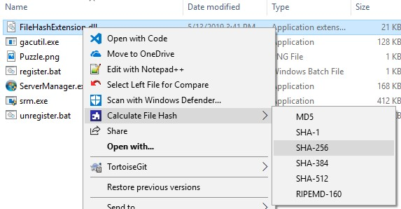
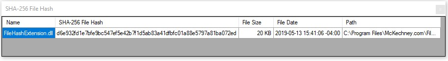
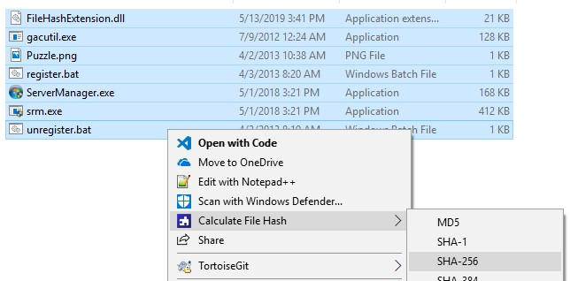
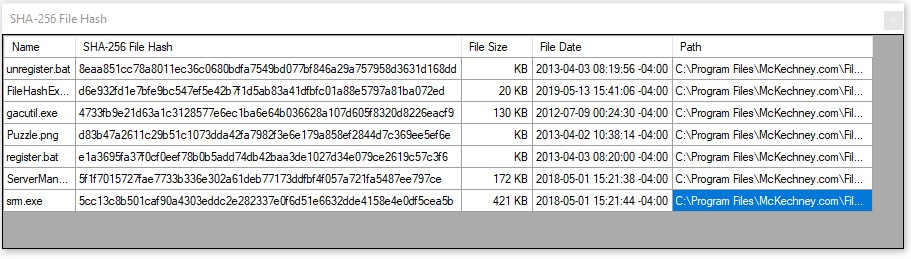

# File Hash Extension

This tool is a Windows Shell extension that will calculate the cryptographic hash of any file. It supports multiple hash algorithms from MD5 through SHA-512 and RIPEMD-160. You can easily leverage this extension to verify the authenticity of your files by comparing the calculated hash value with the one given by the author.

## To install

### MSI Installer 
You can easily install the extension via the MSI installer. Simply click on the installer and follow the instructions

### Manual install
You can install the application by:
1. Unzipping the release package zip to the location of your choice
2. Open an _Adminstrator_ command line window
3. Run the `register.bat` file. You might get a GAC error, that's OK

## Using File Hash Extension
Once you have successfully installed the app, you can right-click on any file to bring up the context menu. You should see a new option "Calculate File Hash".

Select the hash algorithm you want to get the hash calculation

You can also calculate the hash for multiple files as once by selecting more than one file

